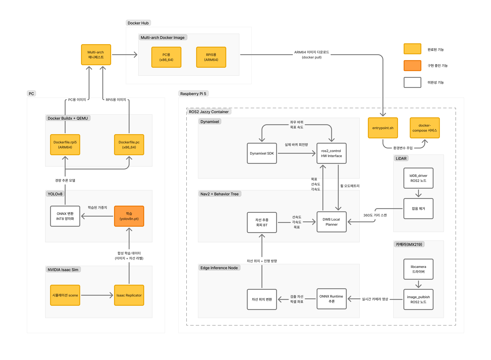

# Docker와 NVIDIA Isaac Sim을 활용한 자율주행 DevOps 체계 구축 및 AI 기반 Sim-to-Real 로봇 제어

---

## 0. 개요

본 프로젝트는 NVIDIA Isaac Sim 기반의 시뮬레이션 환경과 실제 TurtleBot3 로봇을 연결하는 **Sim-to-Real 자율주행 시스템**을 구축하는 것을 목표로 한다.

### 핵심 목표

- **DevOps 파이프라인 구축**: Docker + Buildx를 활용한 x86_64(PC) / ARM64(RPi5) 멀티 아키텍처 빌드 및 배포 자동화
- **가상 환경 시뮬레이션**: NVIDIA Isaac Sim에서 TurtleBot3 URDF를 USD로 변환하고, 가상 카메라·LiDAR 센서 데이터를 ROS2 토픽으로 발행
- **AI 기반 자율주행**: Isaac Replicator로 합성 데이터를 자동 생성하고, YOLOv8 차선 인식 모델을 학습 후 ONNX INT8 양자화로 RPi5에 배포
- **Sim-to-Real 검증**: 시뮬레이션과 실제 환경의 Reality Gap을 최소화하여 가상에서 학습한 모델이 실제 로봇에서도 동작하도록 검증

### 프로젝트 구성

총 14주 과정으로 진행되며, 크게 4단계로 구분된다.

| 단계 | 주차 | 내용 |
|------|------|------|
| **1단계 — DevOps** | 1~3주차 | Docker 환경 구축, 멀티 아키텍처 빌드, 원격 배포 |
| **2단계 — 시뮬레이션** | 4~6주차 | URDF → USD 변환, 가상 센서 연동, 합성 데이터 생성 |
| **3단계 — AI 모델** | 7~9주차 | YOLOv8 학습, ONNX 양자화, 엣지 추론 노드 통합 |
| **4단계 — 통합 제어** | 10~14주차 | DDS 튜닝, Nav2 설계, Dynamixel 제어, 최종 주행 테스트 |

### 기대 성과

- 차선 추종 트랙 완주율 **90% 이상**
- 장애물 회피 성공률 **80% 이상**
- Sim-to-Real 센서 데이터 오차 **10% 이내**
- RPi5 실시간 추론 **15 FPS 이상**

---

## 1. 개발 환경

| 구분 | 사양 |
|------|------|
| **PC OS** | Windows 11 Pro (C:) + Ubuntu 24.04 LTS 듀얼부팅 (D:) |
| **ROS2** | Jazzy Jalisco (Ubuntu 24.04 네이티브 지원) |
| **GPU** | NVIDIA GeForce RTX 5070 Ti (16GB VRAM) |
| **시뮬레이터** | NVIDIA Isaac Sim (Ubuntu에 설치 완료) |
| **엣지 디바이스** | Raspberry Pi 5 (RPi5) + LiDAR + IMX219 카메라 + Dynamixel 모터 |
| **로봇 플랫폼** | TurtleBot3 (RPi5 기반 조립 완료) |
| **컨테이너** | Docker + Buildx (x86_64 / ARM64 멀티아키텍처) |
| **AI 프레임워크** | PyTorch → ONNX Runtime (INT8 양자화) |
| **개발 도구** | Claude Code, Git, Docker Hub |
| **통신** | FastDDS + QoS 프로필 |

---

## 2. 시스템 아키텍처 블록도



### 데이터 흐름 요약

```
[실시간 주행 루프]
센서 → ROS2 토픽 → AI 추론 + Nav2 → 모터 제어 → 로봇 이동 → (반복)

[개발·배포 파이프라인]
Isaac Sim 합성 데이터 → YOLOv8 학습 → ONNX 양자화 → Docker 빌드 → RPi5 배포

[Sim-to-Real 검증]
시뮬레이션 테스트 → 실차 테스트 → 오차 측정 → 파라미터 보정 → (반복)
```

## 2.1 현재 구현 영상
- isaac sim 모델 추론 영상
[video](https://github.com/user-attachments/assets/b8da6f53-130b-422c-8dc0-cb20b96df475)
- raspberry pi 5에 모델 임베딩 후 real track 추론 image


## 3. 주차별 세부 계획

---

### 1주차 — PC 개발 환경 최적화 및 Docker 기초

#### 이번 주 목표
Ubuntu 24.04에서 GPU 가속 Docker 환경을 구축하고, ROS2가 포함된 팀 전용 베이스 이미지를 만든다.

#### 세부 작업

**4-1. NVIDIA Container Toolkit 설치**
- Docker 컨테이너 내부에서 RTX 5070 Ti GPU를 사용할 수 있게 해주는 도구
- 이것이 없으면 컨테이너 안에서 Isaac Sim, PyTorch 등 GPU 작업 불가

```bash
# Claude Code에서 실행할 명령어
# 1) Docker 설치
sudo apt-get update
sudo apt-get install -y docker-ce docker-ce-cli containerd.io docker-buildx-plugin docker-compose-plugin
sudo usermod -aG docker $USER

# 2) NVIDIA Container Toolkit 설치
curl -fsSL https://nvidia.github.io/libnvidia-container/gpgkey | sudo gpg --dearmor -o /usr/share/keyrings/nvidia-container-toolkit-keyring.gpg
curl -s -L https://nvidia.github.io/libnvidia-container/stable/deb/nvidia-container-toolkit.list | \
  sed 's#deb https://#deb [signed-by=/usr/share/keyrings/nvidia-container-toolkit-keyring.gpg] https://#g' | \
  sudo tee /etc/apt/sources.list.d/nvidia-container-toolkit.list
sudo apt-get update && sudo apt-get install -y nvidia-container-toolkit
sudo nvidia-ctk runtime configure --runtime=docker
sudo systemctl restart docker

# 3) GPU 동작 확인
docker run --rm --gpus all nvidia/cuda:12.6.0-base-ubuntu24.04 nvidia-smi
```

**4-2. ROS2 베이스 Docker 이미지 빌드**
- 모든 팀원이 동일한 환경에서 개발할 수 있도록 표준 이미지를 만듦
- ROS2 Jazzy + 필수 패키지가 포함된 Dockerfile 작성

```bash
# 프로젝트 디렉토리 구조 생성
mkdir -p ~/gyusama-project/{docker,src,models,data,configs}
```

#### 용어 정리

| 용어 | 설명 |
|------|------|
| **Docker** | 앱과 실행 환경을 하나로 묶어 어디서나 동일하게 실행할 수 있게 하는 컨테이너 기술 |
| **NVIDIA Container Toolkit** | Docker 컨테이너 안에서 NVIDIA GPU를 사용할 수 있게 해주는 도구 |
| **Docker 이미지** | 컨테이너를 만들기 위한 설계도 (Dockerfile로 정의) |
| **Docker 컨테이너** | 이미지를 실행한 인스턴스 — 격리된 가상 환경에서 프로그램이 돌아감 |
| **Dockerfile** | 이미지를 만들기 위한 명령어가 적힌 텍스트 파일 |
| **베이스 이미지** | 다른 이미지를 만들 때 토대가 되는 기본 이미지 |

#### 완료 기준
- [ ] `docker run --gpus all` 로 컨테이너 내 GPU 인식 확인
- [ ] ROS2 Jazzy 베이스 Dockerfile 작성 및 빌드 성공
- [ ] `ros2 topic list` 가 컨테이너 내에서 정상 동작

---

### 2주차 — Multi-arch 빌드 파이프라인 구축

#### 이번 주 목표
PC(x86_64)에서 빌드한 코드가 RPi5(ARM64)에서도 실행되도록 멀티 아키텍처 빌드 환경을 구성한다.

#### 세부 작업

**2-1. Docker Buildx 환경 설정**
- 단일 Dockerfile로 x86_64(PC)와 ARM64(RPi5) 두 아키텍처의 이미지를 동시에 생성
- QEMU 에뮬레이션을 통해 PC에서 ARM64 이미지를 빌드 가능

```bash
# Buildx 빌더 생성
docker buildx create --name gyusama-builder --use
docker buildx inspect --bootstrap

# QEMU 설치 (ARM64 에뮬레이션)
docker run --rm --privileged multiarch/qemu-user-static --reset -p yes

# 멀티아키텍처 빌드 테스트
docker buildx build --platform linux/amd64,linux/arm64 -t gyusama/ros2-base:latest .
```

**2-2. 교차 빌드 검증**
- 빌드된 ARM64 이미지를 RPi5에 pull하여 정상 실행되는지 확인

#### 용어 정리

| 용어 | 설명 |
|------|------|
| **CPU 아키텍처** | CPU가 명령어를 처리하는 방식. PC는 x86_64, RPi5는 ARM64 |
| **Docker Buildx** | 여러 아키텍처용 이미지를 동시에 빌드하는 Docker 확장 도구 |
| **QEMU** | 다른 CPU 아키텍처를 소프트웨어로 흉내내는 에뮬레이터 |
| **Multi-arch** | 하나의 이미지 이름으로 여러 CPU 아키텍처를 지원하는 것 |
| **크로스 컴파일** | A 아키텍처 컴퓨터에서 B 아키텍처용 실행 파일을 만드는 것 |

#### 완료 기준
- [ ] `docker buildx ls` 에서 multi-platform 빌더 확인
- [ ] x86_64 + ARM64 동시 빌드 성공
- [ ] RPi5에서 빌드된 이미지 pull 후 ROS2 노드 실행 확인

---

### 3주차 — 원격 배포 및 컨테이너 오케스트레이션

#### 이번 주 목표
Docker Hub를 통해 이미지를 관리하고, docker-compose로 여러 ROS2 노드를 한 번에 배포하는 체계를 수립한다.

#### 세부 작업

**3-1. Docker Hub 이미지 레지스트리**
- 빌드된 이미지를 Docker Hub에 push → RPi5에서 pull하여 사용
- 버전 태깅으로 모델 업데이트 이력 관리

```bash
# Docker Hub 로그인 및 push
docker login
docker buildx build --platform linux/amd64,linux/arm64 \
  -t gyusama/turtlebot3-ros2:v1.0 --push .
```

**3-2. docker-compose 서비스 통합**
- 여러 ROS2 노드(카메라, LiDAR, 추론, 제어)를 하나의 설정 파일로 관리

```yaml
# docker-compose.yml 예시 구조
services:
  ros2-core:      # ROS2 기본 노드
  camera-node:    # 카메라 드라이버
  inference-node: # AI 추론
  control-node:   # 모터 제어
```

#### 용어 정리

| 용어 | 설명 |
|------|------|
| **Docker Hub** | Docker 이미지를 저장·공유하는 클라우드 저장소 (GitHub의 이미지 버전) |
| **Push/Pull** | 이미지를 서버에 올리기(Push) / 서버에서 가져오기(Pull) |
| **docker-compose** | 여러 컨테이너를 YAML 파일 하나로 정의하고 한 번에 실행하는 도구 |
| **오케스트레이션** | 여러 컨테이너의 배포·관리·네트워킹을 자동화하는 것 |
| **태깅 (Tagging)** | 이미지에 버전 번호를 붙이는 것 (예: v1.0, v1.1) |

#### 완료 기준
- [ ] Docker Hub에 멀티아키텍처 이미지 push 성공
- [ ] RPi5에서 `docker pull` → `docker compose up` 으로 ROS2 노드 실행
- [ ] PC ↔ RPi5 간 ROS2 토픽 통신 확인

---

### 4주차 — 로봇 모델(URDF)의 고정밀 USD 변환

#### 이번 주 목표
Gazebo용 TurtleBot3 URDF를 Isaac Sim의 USD 포맷으로 변환하고, 실제 로봇과 동일한 물리 파라미터를 부여한다.

#### 세부 작업

**4-1. URDF → USD 변환**
- Isaac Sim의 URDF Importer를 사용하여 TurtleBot3 모델을 변환
- USD(Universal Scene Description): NVIDIA의 3D 장면 포맷, 물리·렌더링 정보 포함

```bash
# Isaac Sim 실행
cd ~/.local/share/ov/pkg/isaac-sim-*/
./isaac-sim.sh

# Isaac Sim GUI에서:
# Isaac Utils → Workflows → URDF Importer
# turtlebot3_burger.urdf 파일 선택 → Import
```

**4-2. 물리 파라미터 튜닝**
- 실제 TurtleBot3과 동일한 질량, 관성 텐서, 조인트 마찰력 설정
- Articulation Root API 설정 (로봇의 물리 시뮬레이션 루트 노드)

#### 용어 정리

| 용어 | 설명 |
|------|------|
| **URDF** | Unified Robot Description Format — 로봇의 링크·조인트·센서를 XML로 기술하는 표준 |
| **USD** | Universal Scene Description — NVIDIA가 채택한 3D 장면 기술 포맷, 물리·렌더링 포함 |
| **질량 (Mass)** | 로봇 각 링크의 무게 [kg] |
| **관성 텐서 (Inertia Tensor)** | 물체가 회전할 때 저항하는 정도를 3×3 행렬로 표현 |
| **조인트 (Joint)** | 로봇의 두 링크를 연결하는 관절 (바퀴 축 등) |
| **마찰력 (Friction)** | 바퀴와 바닥 사이의 미끄러짐 저항 |
| **Articulation Root** | 물리 시뮬레이션에서 로봇의 최상위 제어 지점 |

#### 완료 기준
- [ ] Isaac Sim에서 TurtleBot3 USD 모델 시각화 성공
- [ ] 물리 파라미터(질량, 마찰력) 실제 로봇과 일치 확인
- [ ] 가상 로봇에 힘을 가했을 때 실제와 유사한 움직임 확인

---

### 5주차 (4/1) — 가상 센서(카메라/LiDAR) 연동 및 ROS2 브릿지

#### 이번 주 목표
Isaac Sim 내 가상 IMX219 카메라와 LiDAR를 설정하고, ROS2 Bridge로 데이터를 표준 토픽으로 출력한다.

#### 세부 작업

**5-1. 센서 모델링**
- IMX219 카메라: FOV(화각), 해상도, 렌즈 왜곡 파라미터 설정
- LiDAR: 360° 스캔, 샘플 수, 최소/최대 거리 설정

**5-2. Isaac Sim ROS2 Bridge**
- OmniGraph 노드를 사용하여 가상 센서 데이터를 ROS2 토픽으로 발행
- `/camera/image_raw` (sensor_msgs/Image), `/scan` (sensor_msgs/LaserScan)

```bash
# ROS2 토픽 확인
ros2 topic list
ros2 topic echo /camera/image_raw
ros2 topic echo /scan
```

#### 용어 정리

| 용어 | 설명 |
|------|------|
| **FOV (Field of View)** | 카메라가 촬영할 수 있는 각도 범위 (화각) |
| **ROS2 Bridge** | Isaac Sim의 데이터를 ROS2 네트워크로 연결해주는 다리 역할 |
| **OmniGraph** | Isaac Sim에서 노드 기반으로 로직을 구성하는 비주얼 프로그래밍 도구 |
| **ROS2 토픽 (Topic)** | 노드 간 데이터를 주고받는 이름 있는 채널 (예: `/scan`) |
| **sensor_msgs/Image** | ROS2에서 카메라 이미지를 전달하는 표준 메시지 타입 |
| **sensor_msgs/LaserScan** | ROS2에서 LiDAR 스캔 데이터를 전달하는 표준 메시지 타입 |

#### 완료 기준
- [ ] Isaac Sim에서 카메라/LiDAR 가상 센서 동작 확인
- [ ] ROS2 Bridge를 통해 `/camera/image_raw`, `/scan` 토픽 발행 확인
- [ ] RViz2에서 가상 센서 데이터 시각화 성공

---

### 6주차 (4/8) — Isaac Replicator 기반 합성 데이터 생성

#### 이번 주 목표
Domain Randomization으로 다양한 환경의 합성 데이터를 자동 생성하고, AI 학습용 어노테이션 데이터셋을 수집한다.

#### 세부 작업

**6-1. Domain Randomization 구현**
- 도로 재질, 조명 강도/색온도, 장애물 위치를 랜덤하게 변경
- Isaac Sim Replicator API를 사용한 자동화 스크립트 작성

**6-2. 자동 라벨링 데이터셋 수집**
- 세그멘테이션 마스크, 바운딩 박스 등 AI 학습에 필요한 레이블 자동 생성
- YOLO 형식으로 내보내기

#### 용어 정리

| 용어 | 설명 |
|------|------|
| **합성 데이터 (Synthetic Data)** | 시뮬레이션에서 자동 생성한 학습 데이터 (실제 촬영 불필요) |
| **Domain Randomization** | 환경 요소(조명, 텍스처 등)를 무작위로 변경하여 모델의 일반화 성능을 높이는 기법 |
| **Replicator** | Isaac Sim의 합성 데이터 생성 도구 |
| **어노테이션 (Annotation)** | 이미지에 객체의 위치·클래스를 표시한 레이블 (학습 정답지) |
| **세그멘테이션** | 이미지의 각 픽셀이 어떤 클래스에 속하는지 분류하는 것 |
| **바운딩 박스** | 객체를 둘러싸는 직사각형 좌표 [x, y, w, h] |

#### 완료 기준
- [ ] Domain Randomization 스크립트 동작 확인
- [ ] 합성 이미지 1,000장 이상 자동 생성
- [ ] YOLO 형식 레이블 데이터 정상 출력 확인

---

### 7주차 (4/15) — 딥러닝 기반 차선 인식 모델 학습

#### 이번 주 목표
합성 데이터와 실제 주행 이미지를 혼합하여 YOLOv8 차선 인식 모델을 학습한다.

#### 세부 작업

**7-1. 데이터셋 전처리**
- 합성 데이터 + 실제 주행 이미지의 해상도·색공간 통일
- Train/Validation/Test 분할 (8:1:1)

**7-2. YOLOv8 모델 학습**
```bash
# Ultralytics YOLOv8 학습
pip install ultralytics
yolo detect train data=lane_dataset.yaml model=yolov8n.pt epochs=100 imgsz=640
```

#### 용어 정리

| 용어 | 설명 |
|------|------|
| **YOLOv8** | You Only Look Once v8 — 실시간 객체 탐지 모델, 속도와 정확도 균형이 좋음 |
| **학습 (Training)** | 모델에 데이터를 반복 입력하여 패턴을 익히게 하는 과정 |
| **에포크 (Epoch)** | 전체 학습 데이터를 한 번 모두 본 것 = 1 에포크 |
| **데이터 전처리** | 학습 전 이미지 크기·형식을 통일하고 정제하는 작업 |
| **미세 조정 (Fine-tuning)** | 사전 학습된 모델을 특정 도메인 데이터로 추가 학습하는 것 |
| **mAP (mean Average Precision)** | 객체 탐지 모델의 정확도를 측정하는 대표 지표 |

#### 완료 기준
- [ ] 학습 데이터셋 전처리 완료 (합성 + 실제 혼합)
- [ ] YOLOv8 학습 완료, mAP 70% 이상 달성
- [ ] 테스트 이미지에서 차선 검출 결과 시각화 확인

---

### 8주차 (4/22) — ONNX 변환 및 모델 양자화

#### 이번 주 목표
학습된 PyTorch 모델을 ONNX로 변환하고, INT8 양자화를 적용하여 RPi5에서 실행 가능한 경량 모델을 만든다.

#### 세부 작업

**8-1. PyTorch → ONNX 변환**
```python
from ultralytics import YOLO
model = YOLO("best.pt")
model.export(format="onnx", imgsz=640, simplify=True)
```

**8-2. INT8 양자화**
- FP32(32비트 실수) → INT8(8비트 정수)로 모델 크기와 연산량을 약 4배 줄임
- 정확도 손실은 최소화하면서 RPi5 CPU에서의 추론 속도 극대화

#### 용어 정리

| 용어 | 설명 |
|------|------|
| **ONNX** | Open Neural Network Exchange — AI 모델의 범용 저장 포맷, 다양한 런타임에서 실행 가능 |
| **양자화 (Quantization)** | 모델의 숫자 정밀도를 낮춰 크기와 연산량을 줄이는 기법 |
| **FP32** | 32비트 부동소수점 — 높은 정밀도, 큰 메모리 사용 |
| **INT8** | 8비트 정수 — 낮은 정밀도지만 4배 빠르고 4배 작음 |
| **추론 (Inference)** | 학습 완료된 모델로 새 데이터를 예측하는 것 |
| **ONNX Runtime** | ONNX 모델을 최적화하여 실행하는 런타임 엔진 |

#### 완료 기준
- [ ] ONNX 변환 성공 및 추론 결과 원본과 비교 검증
- [ ] INT8 양자화 완료, 정확도 손실 5% 이내
- [ ] RPi5에서 ONNX Runtime으로 추론 실행 확인

---

### 9주차 (4/29) — 엣지 인퍼런스 노드 통합

#### 이번 주 목표
RPi5 카메라 입력과 최적화된 ONNX 모델을 연결하는 실시간 ROS2 추론 노드를 개발한다.

#### 세부 작업

**9-1. 실시간 추론 파이프라인**
```
IMX219 카메라 → /camera/image_raw → 추론 노드 → /lane_detection → 제어 노드
```
- ROS2 노드로 구현: 카메라 토픽 구독 → ONNX 추론 → 결과 발행

**9-2. FPS 측정 및 최적화**
- 목표: 15 FPS 이상
- 입력 해상도 조정, 추론 주기 최적화

#### 용어 정리

| 용어 | 설명 |
|------|------|
| **엣지 인퍼런스** | 서버가 아닌 현장 기기(RPi5)에서 직접 AI 추론을 수행하는 것 |
| **FPS (Frames Per Second)** | 초당 처리 프레임 수 — 높을수록 빠른 반응 |
| **ROS2 노드** | ROS2 네트워크에서 특정 기능을 수행하는 프로세스 단위 |
| **Subscribe/Publish** | 토픽의 데이터를 받는 것(Subscribe) / 보내는 것(Publish) |
| **파이프라인** | 데이터가 순차적으로 처리되는 흐름 (입력 → 처리 → 출력) |

#### 완료 기준
- [ ] RPi5에서 카메라 → 추론 → 결과 발행 파이프라인 동작
- [ ] 실시간 추론 15 FPS 이상 달성
- [ ] Docker 컨테이너화된 추론 노드 배포 성공

---

### 10주차 (5/6) — RPi5 실물 배포 및 노드 기동 검증

#### 이번 주 목표
Isaac Sim에서 검증된 APF 장애물 회피 시스템을 RPi5에 배포하고, 카메라·LiDAR·모터 전체 노드 기동 및 장애물 감지 동작을 확인한다.

#### 주요 구현

- APF 파라미터 YAML 외부화 (`config/apf_params.yaml`) — 재빌드 없이 현장 튜닝
- 노드 헬스 모니터링 (`scripts/monitor_nodes.py`) — FPS·장애물 상태 실시간 출력
- RPi5 배포 자동화 (`scripts/deploy_rpi5.sh`) — rsync + Docker 원커맨드
- LiDAR 드라이버 수정 — `LDS_MODEL=LDS-02`, `ros-jazzy-ld08-driver` Dockerfile 추가

#### 완료 기준
- [x] RPi5 전체 노드 기동 확인 (camera / inference / obstacle / behavior / control)
- [x] LiDAR `/scan` 데이터 수신 확인 (9.4 Hz)
- [x] 장애물 감지 → 정지 동작 확인
- [⏸] 차선 추종 + 장애물 회피 동시 주행 — NPU 장착 후 진행 (추론 FPS 2~3으로 부족)

> 상세 내용: [`weeks_work/week10/README.md`](weeks_work/week10/README.md)

---

### 11주차 (5/13) — NPU 장착 및 추론 FPS 개선

#### 이번 주 목표
NPU를 RPi5에 장착하여 추론 FPS를 10+ 이상으로 개선하고, 차선 추종 + 장애물 회피 동시 주행을 실물에서 검증한다.

#### 주요 구현

- NPU 드라이버 설치 및 `lane_detect.py` NPU execution provider 적용
- 실물 APF 파라미터 튜닝 (`config/apf_params.yaml`)
- Sim-to-Real 갭 분석 및 문서화

#### 완료 기준
- [ ] NPU 장착 및 드라이버 설치
- [ ] 추론 FPS 10 이상 달성
- [ ] 차선 추종 + 장애물 회피 동시 주행 실물 확인
- [ ] 실물 APF 파라미터 튜닝 완료
- [ ] Sim-to-Real 갭 분석 문서화

> 상세 내용: [`weeks_work/week11/README.md`](weeks_work/week11/README.md)

---

### 12주차 (5/20) — 최종 시연 준비 및 배포 파이프라인 완성

#### 이번 주 목표
Docker Hub 기반 배포 파이프라인으로 전환하고, 최종 시연을 준비한다.

#### 주요 구현

- `docker buildx --platform linux/arm64` → Docker Hub push → RPi5 pull 방식 전환
- 최종 시연 시나리오 검증 (차선 추종 완주율 90%, 장애물 회피 성공률 80%)
- 최종 보고서 작성

#### 완료 기준
- [ ] Docker Hub 이미지 push (`bbanggang/gyusama-rpi5:latest`)
- [ ] RPi5 `docker compose pull && up` 단독 실행 확인
- [ ] 차선 추종 트랙 완주율 90% 이상
- [ ] 장애물 회피 성공률 80% 이상
- [ ] 최종 보고서 제출

> 상세 내용: [`weeks_work/week12/README.md`](weeks_work/week12/README.md)

---

### 13주차 (5/27) — Reality Gap 최소화 및 최종 캘리브레이션

#### 이번 주 목표
가상 카메라와 실제 카메라의 렌즈 왜곡·위치 오차를 보정하고, 실제 노면 마찰력을 시뮬레이션에 반영하여 Sim-to-Real 괴리를 최소화한다.

#### 세부 작업

**13-1. 센서 오차 보정**
- 카메라 내부 파라미터(Intrinsic): 초점거리, 렌즈 왜곡 계수
- 카메라 외부 파라미터(Extrinsic): 로봇 기준 카메라 위치·각도

**13-2. 물리 엔진 보정**
- 실제 트랙의 마찰 계수 측정 → Isaac Sim 바닥 재질에 반영
- 로봇의 실제 가속 성능 측정 → 시뮬레이션 모터 토크 조정

#### 용어 정리

| 용어 | 설명 |
|------|------|
| **Reality Gap** | 시뮬레이션과 실제 환경 사이의 차이 (물리, 시각, 센서 특성 등) |
| **캘리브레이션** | 센서의 오차를 측정하고 보정하는 과정 |
| **Intrinsic 파라미터** | 카메라 렌즈 자체의 특성 (초점거리, 왜곡 계수) |
| **Extrinsic 파라미터** | 카메라의 3D 위치와 방향 (로봇 기준) |
| **마찰 계수** | 두 물체 표면 사이의 미끄러짐 저항 정도 |

#### 완료 기준
- [ ] 카메라 캘리브레이션 완료 (왜곡 보정)
- [ ] 시뮬레이션 vs 실제 센서 데이터 오차 10% 이내
- [ ] 보정된 파라미터로 시뮬레이션 재검증 성공

---

### 14주차 (6/3) — 통합 주행 테스트 및 최종 검토

#### 이번 주 목표
전체 DevOps 파이프라인을 가동하여 차선 추종 및 장애물 회피 자율주행을 최종 완수하고, 성과를 분석한다.

#### 세부 작업

**14-1. 최종 미션 수행**
1. Docker 이미지 빌드 → Docker Hub push → RPi5 pull (DevOps 파이프라인)
2. 차선 추종 자율주행 (YOLOv8 → ONNX 추론 → 조향 제어)
3. 장애물 회피 (LiDAR + Nav2 → 경로 재계획)
4. 전체 트랙 완주

**14-2. 성과 분석 및 문서화**
- 완주율, 평균 속도, 장애물 회피 성공률 측정
- Sim-to-Real 성능 차이 분석
- 프로젝트 보고서 작성

#### 완료 기준
- [ ] 차선 추종 트랙 완주율 90% 이상
- [ ] 장애물 배치 시 회피 성공률 80% 이상
- [ ] 전체 시스템 시연 영상 촬영
- [ ] 최종 보고서 제출

---

## 4. Claude Code 사용 가이드

이 프로젝트는 Claude Code를 활용한 바이브 코딩으로 진행합니다. 아래는 각 단계에서 Claude Code에 요청할 수 있는 프롬프트 예시입니다.

### 1단계 (DevOps) 프롬프트 예시
```
"Ubuntu 24.04에서 ROS2 Jazzy + NVIDIA Container Toolkit이 포함된 
Dockerfile을 작성해줘. GPU 가속을 지원해야 하고, 
TurtleBot3 패키지도 포함해줘."
```

### 2단계 (Isaac Sim) 프롬프트 예시
```
"Isaac Sim에서 TurtleBot3 URDF를 USD로 변환하는 
Python 스크립트를 작성해줘. 
ROS2 Bridge로 카메라와 LiDAR 토픽을 발행하는 
OmniGraph 설정도 포함해줘."
```

### 3단계 (AI 모델) 프롬프트 예시
```
"YOLOv8로 차선 인식 모델을 학습하는 코드를 작성해줘.
학습 후 ONNX로 변환하고 INT8 양자화까지 해줘.
RPi5에서 ONNX Runtime으로 추론하는 ROS2 노드도 만들어줘."
```

### 4단계 (통합 제어) 프롬프트 예시
```
"Nav2 Behavior Tree에서 차선 추종과 장애물 회피를 
전환하는 커스텀 BT 노드를 작성해줘.
FastDDS QoS 프로필도 카메라용과 제어용으로 분리해서 만들어줘."
```

### 5단계 (Sim-to-Real) 프롬프트 예시
```
"카메라 캘리브레이션 스크립트를 작성해줘.
체커보드 패턴으로 내부 파라미터를 추출하고,
결과를 Isaac Sim과 실제 카메라 모두에 적용하는 코드를 만들어줘."
```

---

## 5. 프로젝트 디렉토리 구조

```
gyusama-project/
├── README.md                        # 이 파일
├── config/
│   └── apf_params.yaml              # APF 파라미터 (재빌드 없이 튜닝)
├── docker/
│   ├── Dockerfile.pc                # PC용 (x86_64)
│   ├── Dockerfile.rpi5              # RPi5용 (ARM64)
│   ├── docker-compose.yml           # RPi5 서비스 통합 실행
│   ├── docker-compose.sim.yml       # Isaac Sim 서비스
│   └── entrypoint.sh
├── isaac_sim/
│   ├── assets/                      # TurtleBot3 USD 모델
│   ├── generate_synthetic_data.py   # 합성 데이터 생성
│   ├── run_track_sim.py             # 트랙 시뮬레이션 실행
│   └── ...
├── models/
│   ├── inference_node/              # RPi5 실행 ROS2 노드
│   │   ├── lane_detect.py           # 차선 추종 노드
│   │   ├── obstacle_node.py         # LiDAR 장애물 감지 노드
│   │   └── behavior_manager.py      # APF 행동 조정 노드
│   ├── training/                    # 모델 학습 스크립트
│   │   ├── train_yolo_lane.py
│   │   └── quantize_onnx.py
│   └── runs/                        # 학습된 모델 가중치
│       └── lane_det-3/weights/
│           ├── best.onnx            # FP32 모델 (640×640)
│           └── best_int8.onnx       # INT8 양자화 모델
├── scripts/
│   ├── deploy_rpi5.sh               # PC → RPi5 배포 자동화
│   ├── monitor_nodes.py             # 노드 헬스 모니터링
│   └── ...
├── data/
│   └── synthetic/                   # Isaac Sim 합성 데이터
└── weeks_work/
    ├── week1/ ~ week12/             # 주차별 진행 보고
    └── history/                     # 초기 작업 기록
```

---

## 6. 참고 자료

| 분류 | 자료 | URL |
|------|------|-----|
| **공식 튜토리얼** | ROBOTIS TurtleBot3 AutoRace | https://emanual.robotis.com/docs/en/platform/turtlebot3/autonomous_driving/ |
| **공식 튜토리얼** | Isaac Sim TurtleBot3 URDF Import | https://docs.isaacsim.omniverse.nvidia.com/ |
| **공식 튜토리얼** | Nav2 + TurtleBot3 | https://navigation.ros.org/tutorials/docs/navigation2_on_real_turtlebot3.html |
| **공식 문서** | ROS2 Jazzy | https://docs.ros.org/en/jazzy/ |
| **공식 문서** | Docker Buildx | https://docs.docker.com/buildx/working-with-buildx/ |
| **GitHub** | TurtleBot3 DRL Navigation | https://github.com/tomasvr/turtlebot3_drlnav |
| **GitHub** | MOGI-ROS CNN Line Following | https://github.com/MOGI-ROS/Week-1-8-Cognitive-robotics |
| **GitHub** | ROBOTIS YOLOv8 Detection | https://emanual.robotis.com/docs/en/platform/turtlebot3/basic_examples/ |
